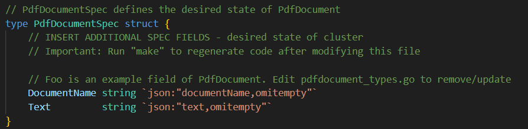
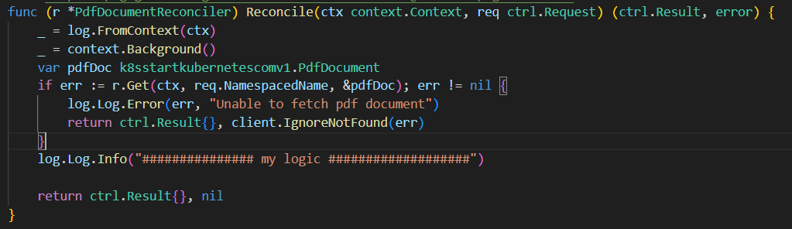

# Pre-Requisite
- ### RKE2 Kubernetes cluster 
- ### Containerization
- ### Container orchestration
- ### Kubernetes architecture
- ### Kubernetes built-in resources
    - **Pod**: The smallest and simplest Kubernetes object. It represents a single instance of a running process in your cluster.

    - **ReplicaSet**: Ensures that a specified number of pod replicas are running at any given time.

    - **Deployment**: Provides declarative updates to Pods and ReplicaSets. It manages the deployment of applications across your cluster.

        - **StatefulSet**: Manages the deployment and scaling of a set of Pods, and provides guarantees about the ordering and uniqueness of these Pods.

        - **DaemonSet**: Ensures that all (or some) nodes run a copy of a Pod. Useful for deploying system daemons such as log collectors, monitoring agents, etc.

    - **Job**: Runs a containerized task to completion. It's useful for batch processing, cron jobs, or one-off tasks.

    - **CronJob**: A scheduler for Jobs. It creates Jobs at a specified time or interval, similar to cron in Unix-like systems.

    - **Service**: Exposes a set of Pods as a network service with a stable IP address and DNS name. It enables communication between different parts of your application.

    - **Ingress**: Manages external access to services in a cluster, typically HTTP.

    - **Secret**: Stores sensitive information such as passwords, OAuth tokens, and SSH keys securely in the cluster.

    - **ConfigMap**: Stores configuration data in key-value pairs that can be consumed by Pods or other resources.

    - **Namespace**: Provides a way to divide cluster resources between multiple users or teams.

    - **ServiceAccount**: Provides an identity for processes that run in a Pod. It's used by Kubernetes to control access to cluster resources.

    - **PersistentVolume**: Represents a piece of storage in the cluster that has been provisioned by an administrator.

    - **PersistentVolumeClaim**: A request for storage by a user. It's used to claim a PersistentVolume for use by a Pod.

    - **StorageClass**: Provides a way for administrators to describe different classes of storage and the provisioner that implements it.

    - **Role**: Defines a set of permissions within a namespace.

    - **ClusterRole**: Defines a set of permissions across the entire cluster.

    - **RoleBinding**: Binds a Role to a user or group within a namespace.

    - **ClusterRoleBinding**: Binds a ClusterRole to a user or group across the entire cluster.
    
# Install kubebuilder
    
    arch=amd64
    curl -L -O https://storage.googleapis.com/kubebuilder-release/kubebuilder_master_linux_${arch}.tar.gz
    tar -zxvf kubebuilder_master_linux_${arch}.tar.gz
    sudo mkdir -p /usr/local/kubebuilder/bin
    sudo mv kubebuilder /usr/local/kubebuilder/bin
    export PATH=$PATH:/usr/local/kubebuilder/bin

# Create custom-resource-controller

    sudo mkdir -p pdf-controller
    cd pdf-controller
    go mod init k8s.startkubernetes.com/v2
    kubebuilder init --domain k8s.startkubernetes.com
    kubebuilder create api --group k8s.startkubernetes.com --version v2 --kind PdfDocument

# write custom logic for your controller
- ## Add fields of your custom-resource in api/v2/pdfdocument_types.go
    - ### Add custome rsource fileds to this struct:
        
    - ### Full code
            /*
            Copyright 2024.
            
            Licensed under the Apache License, Version 2.0 (the "License");
            you may not use this file except in compliance with the License.
            You may obtain a copy of the License at
            
                http://www.apache.org/licenses/LICENSE-2.0
            
            Unless required by applicable law or agreed to in writing, software
            distributed under the License is distributed on an "AS IS" BASIS,
            WITHOUT WARRANTIES OR CONDITIONS OF ANY KIND, either express or implied.
            See the License for the specific language governing permissions and
            limitations under the License.
            */
            
            package v2
            
            import (
            	metav1 "k8s.io/apimachinery/pkg/apis/meta/v1"
            )
            
            // EDIT THIS FILE!  THIS IS SCAFFOLDING FOR YOU TO OWN!
            // NOTE: json tags are required.  Any new fields you add must have json tags for the fields to be serialized.
            
            // PdfDocumentSpec defines the desired state of PdfDocument
            type PdfDocumentSpec struct {
            	// INSERT ADDITIONAL SPEC FIELDS - desired state of cluster
            	// Important: Run "make" to regenerate code after modifying this file
            
            	// Foo is an example field of PdfDocument. Edit pdfdocument_types.go to remove/update
            	DocumentName string `json:"documentName,omitempty"`
            	Text         string `json:"text,omitempty"`
            }
            
            // PdfDocumentStatus defines the observed state of PdfDocument
            type PdfDocumentStatus struct {
            	// INSERT ADDITIONAL STATUS FIELD - define observed state of cluster
            	// Important: Run "make" to regenerate code after modifying this file
            }
            
            //+kubebuilder:object:root=true
            //+kubebuilder:subresource:status
            
            // PdfDocument is the Schema for the pdfdocuments API
            type PdfDocument struct {
            	metav1.TypeMeta   `json:",inline"`
            	metav1.ObjectMeta `json:"metadata,omitempty"`
            
            	Spec   PdfDocumentSpec   `json:"spec,omitempty"`
            	Status PdfDocumentStatus `json:"status,omitempty"`
            }
            
            //+kubebuilder:object:root=true
            
            // PdfDocumentList contains a list of PdfDocument
            type PdfDocumentList struct {
            	metav1.TypeMeta `json:",inline"`
            	metav1.ListMeta `json:"metadata,omitempty"`
            	Items           []PdfDocument `json:"items"`
            }
            
            func init() {
            	SchemeBuilder.Register(&PdfDocument{}, &PdfDocumentList{})
            }

- ## Write your logic inside reconcile method in controllers/pdfdocument_controller.go
    - ### Add your logic to Reconcile method according to your applicaton need
        
    - ### Full code
            /*
            Copyright 2024.
            
            Licensed under the Apache License, Version 2.0 (the "License");
            you may not use this file except in compliance with the License.
            You may obtain a copy of the License at
            
                http://www.apache.org/licenses/LICENSE-2.0
            
            Unless required by applicable law or agreed to in writing, software
            distributed under the License is distributed on an "AS IS" BASIS,
            WITHOUT WARRANTIES OR CONDITIONS OF ANY KIND, either express or implied.
            See the License for the specific language governing permissions and
            limitations under the License.
            */
            
            package controllers
            
            import (
            	"context"
            	"encoding/base64"
            	"fmt"
            
            	batchv1 "k8s.io/api/batch/v1"
            	corev1 "k8s.io/api/core/v1"
            	metav1 "k8s.io/apimachinery/pkg/apis/meta/v1"
            	"k8s.io/apimachinery/pkg/runtime"
            	ctrl "sigs.k8s.io/controller-runtime"
            	"sigs.k8s.io/controller-runtime/pkg/client"
            	"sigs.k8s.io/controller-runtime/pkg/log"
            
            	k8sstartkubernetescomv2 "k8s.startkubernetes.com/v2/api/v2"
            )
            
            // PdfDocumentReconciler reconciles a PdfDocument object
            type PdfDocumentReconciler struct {
            	client.Client
            	Scheme *runtime.Scheme
            }
            
            //+kubebuilder:rbac:groups=k8s.startkubernetes.com.k8s.startkubernetes.com,resources=pdfdocuments,verbs=get;list;watch;create;update;patch;delete
            //+kubebuilder:rbac:groups=k8s.startkubernetes.com.k8s.startkubernetes.com,resources=pdfdocuments/status,verbs=get;update;patch
            //+kubebuilder:rbac:groups=k8s.startkubernetes.com.k8s.startkubernetes.com,resources=pdfdocuments/finalizers,verbs=update
            
            // Reconcile is part of the main kubernetes reconciliation loop which aims to
            // move the current state of the cluster closer to the desired state.
            // TODO(user): Modify the Reconcile function to compare the state specified by
            // the PdfDocument object against the actual cluster state, and then
            // perform operations to make the cluster state reflect the state specified by
            // the user.
            //
            // For more details, check Reconcile and its Result here:
            // - https://pkg.go.dev/sigs.k8s.io/controller-runtime@v0.11.2/pkg/reconcile
            func (r *PdfDocumentReconciler) Reconcile(ctx context.Context, req ctrl.Request) (ctrl.Result, error) {
            	_ = log.FromContext(ctx)
            	_ = context.Background()
            	var pdfDoc k8sstartkubernetescomv2.PdfDocument
            	if err := r.Get(ctx, req.NamespacedName, &pdfDoc); err != nil {
            		log.Log.Error(err, "Unable to fetch pdf document")
            		return ctrl.Result{}, client.IgnoreNotFound(err)
            	}
            
            	jobSpec, err := r.createJob(pdfDoc)
            	if err != nil {
            		log.Log.Error(err, "Failed to create job spec")
            		return ctrl.Result{}, client.IgnoreNotFound(err)
            	}
            	if err != r.Create(ctx, &jobSpec) {
            		log.Log.Error(err, "Unable to create Job")
            	}
            	log.Log.Info("############### my logic ###################")
            
            	return ctrl.Result{}, nil
            }
            
            func (r *PdfDocumentReconciler) createJob(pdfDoc k8sstartkubernetescomv2.PdfDocument) (batchv1.Job, error) {
            	image := "knsit/pandoc"
            	base64text := base64.StdEncoding.EncodeToString([]byte(pdfDoc.Spec.Text))
            
            	j := batchv1.Job{
            		TypeMeta: metav1.TypeMeta{APIVersion: batchv1.SchemeGroupVersion.String(), Kind: "Job"},
            		ObjectMeta: metav1.ObjectMeta{
            			Name:      pdfDoc.Name + "-job",
            			Namespace: pdfDoc.Namespace,
            		},
            		Spec: batchv1.JobSpec{
            			Template: corev1.PodTemplateSpec{
            				Spec: corev1.PodSpec{
            					RestartPolicy: corev1.RestartPolicyOnFailure,
            					InitContainers: []corev1.Container{
            						{
            							Name:    "store-to-md",
            							Image:   "alpine",
            							Command: []string{"/bin/sh"},
            							Args:    []string{"-c", fmt.Sprintf("echo %s | base64 -d >> /data/text.md", base64text)},
            							VolumeMounts: []corev1.VolumeMount{
            								{
            									Name:      "data-volume",
            									MountPath: "/data",
            								},
            							},
            						},
            						{
            							Name:    "convert",
            							Image:   image,
            							Command: []string{"sh", "-c"},
            							Args:    []string{fmt.Sprintf("pandoc -s -o /data/%s.pdf /data/text.md", pdfDoc.Spec.DocumentName)},
            							VolumeMounts: []corev1.VolumeMount{
            								{
            									Name:      "data-volume",
            									MountPath: "/data",
            								},
            							},
            						},
            					},
            					Containers: []corev1.Container{
            						{
            							Name:    "main",
            							Image:   "alpine",
            							Command: []string{"sh", "-c", "sleep 3600"},
            							Args:    []string{fmt.Sprintf("pandoc -s -o /data/%s.pdf /data/text.md", pdfDoc.Spec.DocumentName)},
            							VolumeMounts: []corev1.VolumeMount{
            								{
            									Name:      "data-volume",
            									MountPath: "/data",
            								},
            							},
            						},
            					},
            					Volumes: []corev1.Volume{
            						{
            							Name: "data-volume",
            							VolumeSource: corev1.VolumeSource{
            								EmptyDir: &corev1.EmptyDirVolumeSource{},
            							},
            						},
            					},
            				},
            			},
            		},
            	}
            
            	return j, nil
            }
            
            // SetupWithManager sets up the controller with the Manager.
            func (r *PdfDocumentReconciler) SetupWithManager(mgr ctrl.Manager) error {
            	return ctrl.NewControllerManagedBy(mgr).
            		For(&k8sstartkubernetescomv2.PdfDocument{}).
            		Complete(r)
            }

# Create custom-resource-defination
- ## command to generate custom-resource-defination
       make manifests
- ## Content of custom-resource-defination
       ---
        apiVersion: apiextensions.k8s.io/v1
        kind: CustomResourceDefinition
        metadata:
          annotations:
            controller-gen.kubebuilder.io/version: v0.8.0
          creationTimestamp: null
          name: pdfdocuments.k8s.startkubernetes.com.k8s.startkubernetes.com
        spec:
          group: k8s.startkubernetes.com.k8s.startkubernetes.com
          names:
            kind: PdfDocument
            listKind: PdfDocumentList
            plural: pdfdocuments
            singular: pdfdocument
          scope: Namespaced
          versions:
          - name: v2
            schema:
              openAPIV3Schema:
                description: PdfDocument is the Schema for the pdfdocuments API
                properties:
                  apiVersion:
                    description: 'APIVersion defines the versioned schema of this representation
                      of an object. Servers should convert recognized schemas to the latest
                      internal value, and may reject unrecognized values. More info: https://git.k8s.io/community/contributors/devel/sig-architecture/api-conventions.md#resources'
                    type: string
                  kind:
                    description: 'Kind is a string value representing the REST resource this
                      object represents. Servers may infer this from the endpoint the client
                      submits requests to. Cannot be updated. In CamelCase. More info: https://git.k8s.io/community/contributors/devel/sig-architecture/api-conventions.md#types-kinds'
                    type: string
                  metadata:
                    type: object
                  spec:
                    description: PdfDocumentSpec defines the desired state of PdfDocument
                    properties:
                      documentName:
                        description: Foo is an example field of PdfDocument. Edit pdfdocument_types.go
                          to remove/update
                        type: string
                      text:
                        type: string
                    type: object
                  status:
                    description: PdfDocumentStatus defines the observed state of PdfDocument
                    type: object
                type: object
            served: true
            storage: true
            subresources:
              status: {}
        status:
          acceptedNames:
            kind: ""
            plural: ""
          conditions: []
          storedVersions: []

- ## Command to create Custom-resource-defination
        kubectl create -f config/crd/bases/k8s.startkubernetes.com.k8s.startkubernetes.com_pdfdocuments.yaml
# Execute custom-resource-controller
    make run
# Create custom-resource
- ## Content of resource manifest file (config/samples/k8s.startkubernetes.com_v2_pdfdocument.yaml)
        apiVersion: k8s.startkubernetes.com.k8s.startkubernetes.com/v2
        kind: PdfDocument
        metadata:
        name: pdfdocument-sample
        spec:
        documentName: my-text
        text: |
            ##my document
            hello **world**!

-   ## Command to create custom resource object
        kubectl apply -f config/samples/k8s.startkubernetes.com_v2_pdfdocument.yaml
-   ## Command to get pdf file
        kubectl cp $(kubectl get pods | grep -i my-document | awk '{print $1}'):/data/my-text.pdf my-pdf.pdf

